# Architecture Documentation

This document provides detailed architectural diagrams and flow explanations for the NLP-JPYC Cross-Chain Bridge.

## Table of Contents

- [Overview](#overview)
- [Success Flow](#success-flow)
- [Failure Flow](#failure-flow)
- [Contract Interactions](#contract-interactions)
- [Message Format](#message-format)

## Overview

The bridge uses a Lock/Unlock/Burn pattern with bidirectional messaging to ensure atomicity. When a user sends NLP from Soneium:

1. **Lock Phase**: NLP is locked on Soneium (not immediately burned)
2. **Request Phase**: A REQUEST message is sent to Polygon
3. **Exchange Phase**: Polygon attempts to transfer JPYC to the user
4. **Response Phase**: A RESPONSE message is sent back to Soneium
5. **Finalization Phase**: Based on response, NLP is either burned (success) or unlocked (failure)

This ensures that users never lose their NLP tokens even if JPYC transfer fails.

## Success Flow

When JPYC transfer succeeds on Polygon, the locked NLP is burned on Soneium.

```mermaid
sequenceDiagram
    actor User
    participant NLPToken as NLP Token<br/>(Soneium)
    participant Adapter as NLPOAppAdapter<br/>(Soneium)
    participant LZ as LayerZero<br/>Network
    participant Receiver as NLPOAppJPYCReceiver<br/>(Polygon)
    participant Vault as JPYCVault<br/>(Polygon)
    participant JPYC as JPYC Token<br/>(Polygon)
    participant Burner as NLPMinterBurner<br/>(Soneium)

    Note over User,Burner: 🟢 Success Flow

    User->>NLPToken: approve(Adapter, 100 NLP)
    NLPToken-->>User: ✓ Approved

    User->>Adapter: send(Polygon, recipient, 100 NLP) + fee
    activate Adapter
    Adapter->>NLPToken: transferFrom(User, Adapter, 100 NLP)
    NLPToken-->>Adapter: ✓ Transferred

    Note over Adapter: 🔒 Lock: lockedBalances[User] += 100

    Adapter->>LZ: Send REQUEST message
    Note right of Adapter: MessageType: REQUEST<br/>GiftMessage {<br/>  recipient: User<br/>  amount: 100 NLP<br/>}
    deactivate Adapter

    LZ->>Receiver: Deliver REQUEST message
    activate Receiver

    Note over Receiver: Calculate JPYC: 100 NLP × rate

    Receiver->>Vault: withdraw(User, 100 JPYC)
    activate Vault
    Vault->>JPYC: transfer(User, 100 JPYC)
    JPYC-->>User: ✓ 100 JPYC received
    Vault-->>Receiver: ✓ Success
    deactivate Vault

    Note over Receiver: ✅ JPYC transfer succeeded

    Receiver->>LZ: Send RESPONSE (success=true)
    Note right of Receiver: MessageType: RESPONSE<br/>ResponseMessage {<br/>  user: User<br/>  amount: 100 NLP<br/>  success: true<br/>}
    deactivate Receiver

    LZ->>Adapter: Deliver RESPONSE (success=true)
    activate Adapter

    Note over Adapter: 🔥 Burn: lockedBalances[User] -= 100

    Adapter->>Burner: burn(Adapter, 100 NLP)
    activate Burner
    Burner->>NLPToken: burn(100 NLP)
    NLPToken-->>Burner: ✓ Burned
    Burner-->>Adapter: ✓ Burned
    deactivate Burner
    deactivate Adapter

    Note over User,Burner: ✅ Complete: User received JPYC, NLP burned
```



## Failure Flow

When JPYC transfer fails on Polygon (e.g., insufficient vault balance), the locked NLP is automatically unlocked and returned to the user.


## Contract Interactions

### Soneium Chain Components


### Polygon Chain Components

```mermaid
graph TB
    LZ[LayerZero<br/>Endpoint]
    Receiver[NLPOAppJPYCReceiver<br/>Exchange Logic]
    Vault[JPYCVault<br/>Liquidity Pool]
    JPYC[JPYC Token<br/>ERC20]
    User[👤 User<br/>on Polygon]
    Operator[🔧 Operator<br/>Wallet]

    LZ -->|1. deliver request| Receiver
    Receiver -->|2. try withdraw| Vault
    Vault -->|3. transfer| JPYC
    JPYC -->|4. send to user| User
    Receiver -->|5. send response| LZ

    Operator -->|deposit JPYC| Vault

    style Receiver fill:#e1f5ff
    style Vault fill:#fff4e1
    style LZ fill:#f0f0f0
    style Operator fill:#e8f5e9
```



## Message Format

### REQUEST Message (Soneium → Polygon)

```solidity
struct GiftMessage {
    address recipient;  // JPYC recipient on Polygon
    uint256 amount;     // NLP amount (locked on Soneium)
}

// Encoded as:
bytes memory message = abi.encode(
    MessageType.REQUEST,
    abi.encode(GiftMessage({
        recipient: user,
        amount: nlpAmount
    }))
);
```

### RESPONSE Message (Polygon → Soneium)

```solidity
struct ResponseMessage {
    address user;       // Original NLP sender
    uint256 amount;     // NLP amount (locked)
    bool success;       // Did JPYC transfer succeed?
}

// Encoded as:
bytes memory message = abi.encode(
    MessageType.RESPONSE,
    abi.encode(ResponseMessage({
        user: sender,
        amount: nlpAmount,
        success: jpycTransferSucceeded
    }))
);
```

## Key Design Decisions

### 1. Why Lock Instead of Immediate Burn?

**Problem**: If we burn immediately and JPYC transfer fails, user loses NLP forever.

**Solution**: Lock first, wait for confirmation, then burn or unlock based on result.

### 2. Why Bidirectional Messaging?

**Problem**: One-way message means no feedback if destination operation fails.

**Solution**: Response message ensures source chain knows the outcome and can react appropriately.

### 3. Why Not Mint NLP on Polygon?

**Problem**: Minting on Polygon requires managing NLP supply across chains and adds complexity.

**Solution**: Direct JPYC exchange simplifies the flow and reduces gas costs.

### 4. How to Prevent Stuck Funds?

**Scenario 1**: JPYC transfer succeeds → NLP burned → ✅ Correct state
**Scenario 2**: JPYC transfer fails → NLP unlocked → ✅ Correct state
**Scenario 3**: Response message never arrives → User can't unstuck manually → ⚠️ Edge case

**Mitigation**:
- Receiver must be well-funded with native tokens for responses
- Monitoring system to detect stuck messages
- Admin function to manually unlock in extreme cases (requires governance)

## Gas Estimates

### LayerZero Implementation

| Operation | Estimated Gas | USD Cost* |
|-----------|--------------|-----------|
| Lock NLP (Soneium) | ~100,000 | $0.10 |
| LayerZero Message Fee | Variable | $0.50-$2.00 |
| JPYC Transfer (Polygon) | ~70,000 | $0.02 |
| Response Message | ~80,000 | $0.02 |
| Burn NLP (Soneium) | ~50,000 | $0.05 |
| **Total** | | **$0.69-$2.19** |

*Approximate costs based on: ETH @ $3,000, MATIC @ $0.80

### CCIP Implementation

| Operation | Estimated Gas | USD Cost* |
|-----------|--------------|-----------|
| Lock NLP (Soneium) | ~100,000 | $0.10 |
| CCIP Message Fee | Variable | $1.00-$3.00 |
| JPYC Transfer (Polygon) | ~70,000 | $0.02 |
| Response Message | ~80,000 | $0.02 |
| Burn NLP (Soneium) | ~50,000 | $0.05 |
| **Total** | | **$1.19-$3.19** |

## Security Considerations

**📊 Security Audit**: A comprehensive Slither static analysis has been completed. [View the full security audit report →](./SECURITY_AUDIT.md)

### 1. Reentrancy Protection

All state-changing functions use OpenZeppelin's `ReentrancyGuard`:

```solidity
function send(...) external payable nonReentrant {
    // Safe from reentrancy attacks
}
```

### 2. Access Control

- Only authorized adapters can call `NLPMinterBurner.burn()`
- Only authorized receivers can call `JPYCVault.withdraw()`
- All admin functions protected by `onlyOwner`

### 3. Message Validation

```solidity
// Verify message sender
if (_origin.sender != peers[_origin.srcEid]) revert UnauthorizedPeer();

// Verify message type
(MessageType msgType, bytes memory data) = abi.decode(_message, (MessageType, bytes));
if (msgType != MessageType.REQUEST) revert InvalidMessageType();
```

### 4. Balance Tracking

```solidity
// Locked balances are tracked per user
mapping(address => uint256) public lockedBalances;

// Cannot unlock more than locked
if (lockedBalances[user] < amount) revert InsufficientLockedBalance();
```

## Monitoring & Alerts

### Critical Metrics to Monitor

1. **Vault Balance**: Alert when JPYC balance < threshold
   ```bash
   cast call $VAULT_ADDRESS "balance()(uint256)" --rpc-url $POLYGON_RPC
   ```

2. **Receiver Native Balance**: Alert when < 0.1 ETH (for response messages)
   ```bash
   cast balance $RECEIVER_ADDRESS --rpc-url $POLYGON_RPC
   ```

3. **Failed Exchanges**: Monitor `JPYCTransferFailed` events
   ```bash
   cast logs --address $RECEIVER_ADDRESS \
     --events "JPYCTransferFailed(address,uint256,uint256)" \
     --rpc-url $POLYGON_RPC
   ```

4. **Locked Balance Growth**: Detect if locked balances keep growing (potential stuck messages)
   ```bash
   cast call $ADAPTER_ADDRESS "lockedBalances(address)(uint256)" $USER --rpc-url $SONEIUM_RPC
   ```

## Upgrade Path

### Current: Non-Upgradeable

All contracts are currently non-upgradeable for maximum security and simplicity.

### Future: Potential Upgrade Patterns

If upgradeability is needed:

1. **Transparent Proxy Pattern** (OpenZeppelin)
   - Pros: Secure, well-audited
   - Cons: Higher gas costs

2. **UUPS Pattern** (Universal Upgradeable Proxy Standard)
   - Pros: Lower gas costs
   - Cons: More complex

3. **Contract Migration**
   - Pros: Clean slate, no proxy complexity
   - Cons: Requires user action to migrate

**Recommendation**: Start non-upgradeable, add upgradeability only if absolutely necessary after security audit.
