# NLP-JPYC Cross-Chain Bridge

A secure cross-chain bridge enabling users to transfer NewLoPoint (NLP) tokens from Soneium to Polygon and automatically exchange them for JPYC.

---

## ⚠️ Disclaimer

**This smart contract system is experimental and under active development.**

- 🚧 The code is subject to change without notice
- 🔬 Not yet audited by a third-party security firm
- ⚠️ Use at your own risk - no warranties provided
- 🧪 Please conduct thorough testing and auditing before production use
- 💰 Never deploy to mainnet without professional security audit

**Status**: Development/Testing Phase | **Not Production Ready**

---

## Features

- ✅ **Automatic Failure Recovery**: No manual intervention if JPYC transfer fails
- ✅ **Bidirectional Messaging**: Ensures atomicity with response messages
- ✅ **Lock/Unlock/Burn Pattern**: Secure token handling with automatic unlock on failure
- ✅ **Dual Protocol Support**: Both LayerZero V2 and Chainlink CCIP implementations
- ✅ **Direct Exchange**: No intermediate token minting on destination chain

## Architecture

### High-Level Flow

```mermaid
sequenceDiagram
    participant User
    participant Soneium as Soneium<br/>(NLPOAppAdapter)
    participant Network as LayerZero /<br/>CCIP
    participant Polygon as Polygon<br/>(NLPOAppJPYCReceiver)

    User->>Soneium: 1. Send 100 NLP
    Note over Soneium: 🔒 Lock 100 NLP
    Soneium->>Network: 2. REQUEST message
    Network->>Polygon: 3. Deliver

    alt JPYC Available
        Polygon->>User: 4a. Transfer 100 JPYC ✅
        Polygon->>Network: 5a. RESPONSE (success)
        Network->>Soneium: 6a. Deliver
        Note over Soneium: 🔥 Burn 100 NLP
    else JPYC Insufficient
        Note over Polygon: 4b. Transfer fails ❌
        Polygon->>Network: 5b. RESPONSE (failure)
        Network->>Soneium: 6b. Deliver
        Note over Soneium: 🔓 Unlock 100 NLP
        Soneium->>User: 7b. Return 100 NLP
    end
```



### Component Diagram

```
Soneium Chain                    Polygon Chain
┌──────────────┐                ┌─────────────────┐
│ User         │                │ JPYCVault       │
│   ↓          │                │   ↓             │
│ NLPOAppAdapter│ ── REQUEST ──→│ NLPOAppJPYCReceiver│
│   (Lock NLP) │                │   (Try JPYC)    │
│   ↓          │                │   ↓             │
│  ← RESPONSE ─────────────────│  ← Response     │
│(Burn/Unlock) │                └─────────────────┘
└──────────────┘
```

📖 **[View Detailed Architecture Documentation →](./ARCHITECTURE.md)**

## Quick Start

### Prerequisites

- [Foundry](https://book.getfoundry.sh/getting-started/installation)
- Node.js 18+ (for deployment scripts)

### Build & Test

```bash
# Install dependencies
forge install

# Build contracts
forge build

# Run all tests
forge test

# Run tests with gas report
forge test --gas-report
```

### Deploy

#### LayerZero Deployment

```bash
# 1. Deploy on Soneium
forge script script/DeployLayerZero.s.sol:DeploySoneiumLayerZero \
  --rpc-url $SONEIUM_RPC \
  --broadcast \
  --verify

# 2. Deploy on Polygon
forge script script/DeployLayerZero.s.sol:DeployPolygonLayerZero \
  --rpc-url $POLYGON_RPC \
  --broadcast \
  --verify

# 3. Configure peers
forge script script/DeployLayerZero.s.sol:ConfigureLayerZeroPeers \
  --rpc-url $SONEIUM_RPC \
  --broadcast
```

#### CCIP Deployment

```bash
# 1. Deploy on Soneium
forge script script/DeployCCIP.s.sol:DeploySoneiumCCIP \
  --rpc-url $SONEIUM_RPC \
  --broadcast \
  --verify

# 2. Deploy on Polygon
forge script script/DeployCCIP.s.sol:DeployPolygonCCIP \
  --rpc-url $POLYGON_RPC \
  --broadcast \
  --verify

# 3. Configure
forge script script/DeployCCIP.s.sol:ConfigureCCIPChains \
  --rpc-url $SONEIUM_RPC \
  --broadcast
```

## Usage

```typescript
// Approve NLP to adapter
await nlpToken.approve(adapterAddress, amount);

// Send cross-chain
await adapter.send(
  POLYGON_EID,      // Destination
  recipientAddress, // JPYC recipient
  amount,           // NLP amount
  "",               // Extra options
  { value: fee }    // Cross-chain fee
);

// Automatic process:
// 1. NLP locked on Soneium
// 2. Message sent to Polygon
// 3. JPYC transferred (if available)
// 4. Response sent back
// 5. NLP burned (success) or unlocked (failure)
```

## Contracts

### Soneium Chain
- **NLPMinterBurner**: Authorized burner for NLP tokens
- **NLPOAppAdapter**: LayerZero adapter (Lock/Unlock/Burn)
- **NLPCCIPAdapter**: CCIP adapter (Lock/Unlock/Burn)

### Polygon Chain
- **JPYCVault**: JPYC liquidity pool
- **NLPOAppJPYCReceiver**: LayerZero receiver + exchange
- **NLPCCIPJPYCReceiver**: CCIP receiver + exchange

## Testing

- **Unit Tests**: Individual contract functionality
- **Integration Tests**: Full cross-chain flow with mocks
- **Test Coverage**: 15/16 tests passing (93.75%)

```bash
# Run specific test suite
forge test --match-contract IntegrationTest

# Run with verbosity
forge test -vvv
```

## Security

- ✅ Automatic failure recovery prevents fund loss
- ✅ Role-based access control on vault
- ✅ Bidirectional messaging ensures atomicity
- ✅ No funds can get stuck in transit
- ✅ Slither static analysis completed (all medium-severity issues fixed)

**Security Audit:**
- [Slither Static Analysis Report](./SECURITY_AUDIT.md) - Comprehensive security audit results

**Before mainnet:**
- [x] Slither static analysis
- [ ] Professional third-party security audit
- [ ] Testnet verification
- [ ] Multisig for admin roles
- [ ] Response message funding monitoring

## Documentation

- [CLAUDE.md](./CLAUDE.md) - Detailed technical guide and operational procedures
- [Architecture Details](./CLAUDE.md#architecture) - In-depth architecture documentation

## License

This project is licensed under the **MIT License**.

**Key Points**:
- ✅ Free to use, modify, and distribute
- ✅ Commercial use allowed
- ⚠️ Provided "AS IS" without warranty of any kind
- ⚠️ Authors are not liable for any damages or losses

See [LICENSE](./LICENSE) file for full license text.

**Third-Party Dependencies**:
- LayerZero V2: [License](https://github.com/LayerZero-Labs/LayerZero-v2/blob/main/LICENSE)
- Chainlink CCIP: [License](https://github.com/smartcontractkit/chainlink/blob/develop/LICENSE)
- OpenZeppelin Contracts: [MIT License](https://github.com/OpenZeppelin/openzeppelin-contracts/blob/master/LICENSE)

## Resources

- [LayerZero V2 Docs](https://docs.layerzero.network/v2)
- [Chainlink CCIP Docs](https://docs.chain.link/ccip)
- [Foundry Book](https://book.getfoundry.sh/)
